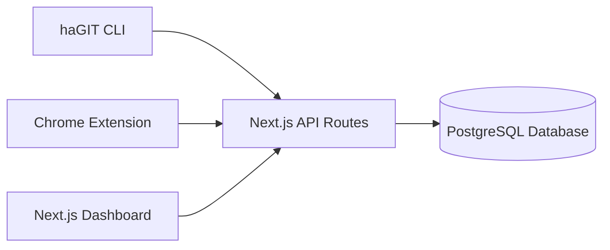
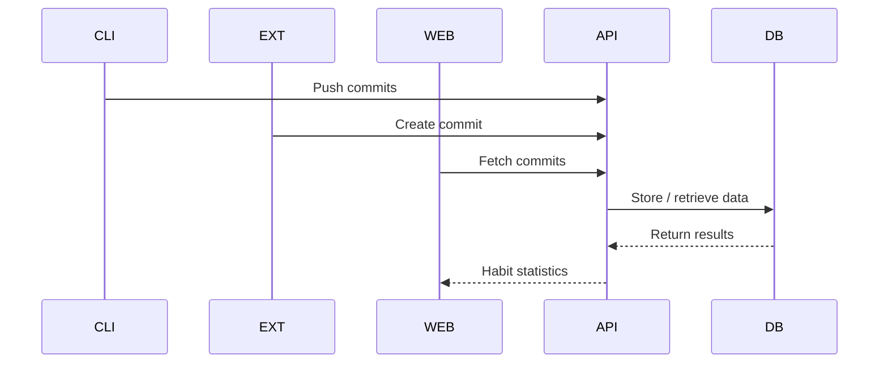

# haGIT

haGIT is a Git-inspired habit tracking system designed for developers and technical users who prefer structured workflows over traditional habit-tracking interfaces.

Instead of checklists or streak counters, haGIT models habits using familiar version control concepts such as **branches, commits, logs, and pushes**. This allows habit actions to be recorded, organized, and synchronized in a workflow similar to Git.

The system consists of three primary components:

1. **haGIT CLI** — a command-line interface for recording and managing habit actions locally.
2. **Web Dashboard** — a Next.js web application that visualizes habit activity.
3. **Chrome Extension** — a lightweight interface for quickly creating commits and managing habits.

Together, these components provide both **developer-friendly workflows** and **visual insight into habit consistency**.

---

# System Architecture

The haGIT ecosystem follows a centralized architecture where multiple clients interact with a unified backend implemented using **Next.js API routes**.



### Interaction Overview

* The **CLI** records habit commits locally and pushes them to the server.
* The **Chrome Extension** allows quick habit management and commit creation.
* The **Web Dashboard** provides visual analytics and habit insights.
* **Next.js API routes** handle authentication, habits, commits, and database interaction.
* The **database** stores users, habits, and commit records.

All clients communicate with the same API routes to ensure consistent behavior across the ecosystem.

---

# Technology Stack

The haGIT platform uses modern JavaScript tooling across the CLI, dashboard, extension, and backend.

| Layer              | Technology                     | Purpose                                |
| ------------------ | ------------------------------ | -------------------------------------- |
| Frontend Framework | Next.js (App Router)           | Dashboard UI and API routes            |
| Language           | TypeScript / JavaScript        | Application development                |
| Styling            | TailwindCSS                    | Utility-first styling                  |
| UI Components      | shadcn/ui                      | Accessible UI primitives               |
| State Management   | Zustand                        | Global application state               |
| Data Fetching      | TanStack Query                 | Server state synchronization           |
| Forms              | React Hook Form                | Form handling and validation           |
| ORM                | Prisma                         | Database access layer                  |
| Database           | PostgreSQL (Neon)              | Managed cloud database                 |
| CLI Framework      | Commander.js                   | Command parsing                        |
| CLI UX             | Ora                            | Terminal spinners                      |
| HTTP Client        | Axios                          | API requests                           |
| Terminal Styling   | Chalk                          | CLI output formatting                  |
| Browser Extension  | Chrome Extension (Manifest v3) | Quick habit interaction                |
| Runtime            | Node.js                        | Backend runtime for Next.js API routes |

---

# CLI Installation

The haGIT CLI is distributed via npm.

Install it globally:

```
npm install -g hagit-cli
```

Verify installation:

```
hagit --version
```

The CLI package is available at:

https://www.npmjs.com/package/hagit-cli

Global installation allows the `hagit` command to be executed from any directory.

---

# CLI Command Reference

The CLI provides a Git-like interface for managing habits.

| Command                      | Description                  | Example                         |
| ---------------------------- | ---------------------------- | ------------------------------- |
| `hagit init`                 | Initialize haGIT workspace   | `hagit init`                    |
| `hagit login -t <token>`     | Authenticate CLI with server | `hagit login -t TOKEN`          |
| `hagit branch -m <habit>`    | Create a new habit           | `hagit branch -m exercise`      |
| `hagit branch -d <habit>`    | Delete an existing habit     | `hagit branch -d exercise`      |
| `hagit checkout <habit>`     | Switch current habit         | `hagit checkout reading`        |
| `hagit commit -m <message>`  | Record a habit action        | `hagit commit -m "morning run"` |
| `hagit commit -d <commitId>` | Delete a commit              | `hagit commit -d 123`           |
| `hagit log`                  | Show commit history          | `hagit log`                     |
| `hagit status`               | Display workspace state      | `hagit status`                  |
| `hagit reset`                | Clear unpushed commits       | `hagit reset`                   |
| `hagit push`                 | Sync commits with server     | `hagit push`                    |

---

# CLI Workflow

A typical workflow using the CLI:

```
hagit init
hagit login -t <token>
hagit branch -m exercise
hagit checkout exercise
hagit commit -m "morning run"
hagit push
```

### Workflow Explanation

1. **Initialize workspace**

Creates local configuration used to track habits and commits.

2. **Authenticate**

Links the CLI with the user account via token authentication.

3. **Create habit**

Defines a new habit branch.

4. **Switch habit**

Sets the active habit context.

5. **Commit action**

Records a completed habit action locally.

6. **Push commits**

Synchronizes local commits with the server.

---

# Web Dashboard

The web dashboard provides a visual interface for monitoring habit progress.

### Features

* Habit management
* Commit history visualization
* Contribution heatmaps
* Aggregated activity statistics
* User account management
* Token management for CLI authentication

The dashboard emphasizes **visual insights and analytics**, helping users identify patterns in their habit consistency.

---

# Chrome Extension

The Chrome extension provides a fast interface for interacting with haGIT without opening the dashboard.

### Capabilities

* Create commits quickly
* Manage habits
* View recent commits
* Authenticate using token
* Perform CRUD operations on habits and commits

The extension communicates with the same **Next.js API routes** used by the CLI and dashboard.

### Loading the Extension

1. Build the extension.
2. Open the Chrome extensions page:

```
chrome://extensions
```

3. Enable **Developer Mode**.
4. Click **Load unpacked**.
5. Select the extension build directory.

---

# Full System Workflow

The entire system integrates CLI, extension, dashboard, and backend services.



### Execution Flow

1. CLI records habit actions locally.
2. CLI pushes commits to the server.
3. Next.js API routes store commits in the PostgreSQL database.
4. The dashboard retrieves and visualizes the data.
5. The extension allows quick commit entry and habit management.

---

# Repository Structure

A typical repository layout:

```
/cli
/extension
/prisma
/src
```

### Directory Overview

| Directory    | Purpose                                                   |
| ------------ | --------------------------------------------------------- |
| `/cli`       | Command-line interface implementation                     |
| `/extension` | Chrome extension source code                              |
| `/prisma`    | Database schema and migrations                            |
| `/src`       | Next.js application including dashboard UI and API routes |

The **Next.js API routes are implemented inside the `/src` directory**, following the App Router structure.

---

# Development Setup

Clone the repository and install dependencies:

```
npm install
```

### Run the Dashboard

```
npm run dev
```

### Build the Application

```
npm run build
```

---

# Extension Development

Run extension development mode:

```
npm run dev
```

Build production extension:

```
npm run build
```

The build output will contain the compiled extension ready to load in Chrome.

---

# Extension Release

After running:

```
npm run build
```

the extension build directory will contain:

```
manifest.json
popup.html
assets
scripts
```

This folder can be loaded via the Chrome extensions page.

---

# Authentication Model

Authentication across the system uses **JWT tokens**.

Authentication flow:

1. User signs in through the dashboard.
2. A JWT token is generated.
3. The token is used by the CLI and extension.
4. Each request to the API routes is verified using the token.

This ensures secure authentication across all clients.

---

# Habit Tracking Model

Each habit behaves like a branch in version control.

Example habits:

```
exercise
reading
meditation
coding
```

Commits represent completed habit actions:

```
exercise
 ├ morning run
 ├ gym session
 └ stretching routine
```

This model allows habits to maintain independent histories while contributing to overall activity metrics.

---

# Design Philosophy

haGIT is built around a simple idea:

**Consistency improves when workflows are structured and visible.**

By combining:

* developer-friendly CLI workflows
* quick browser extension interactions
* visual dashboard analytics

haGIT creates a system that integrates naturally into a developer’s daily workflow.

---

# License

MIT License
